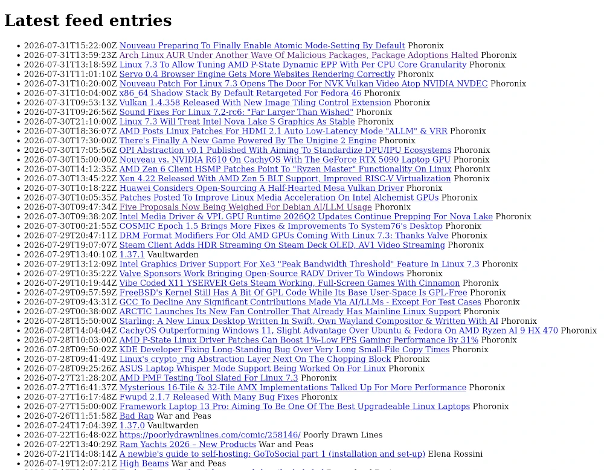

# Morning Coffee

I was using [Newsboat](https://newsboat.org/) on my laptop to follow a bunch of RSS feeds. It's a lightweight TUI client that's pretty good at its job. At the same time, I wanted a reader that I could use on other machines without the overhead of synchronizing[^1] its state across multiple devices. That's how I got the idea to create this project.

Morning Coffee produces a plain, boring HTML page with links to the latest entries from the feeds it is configured to follow. There is no interactivity or additional functionality. In this regard, my project cannot replace Newsboat or any other proper RSS client, but it fully[^2] satisfies my needs.

I called it Morning Coffee because I associate a morning newspaper with a cup of coffee. God knows why, as I've never read newspapers.

It's a practice project that I started so I could write something in more or less plain Java, without dependencies that encapsulate all the complexity, such as Spring or Hibernate. I also made some reasonable[^3] trade-offs to avoid reinventing too many wheels at once. I might come back to them later! 😃

[^1]: To be clear, there are [some options](https://newsboat.org/releases/2.44/docs/newsboat.html#_newsboat_as_a_client_for_newsreading_services) if that's what you want.

[^2]: This might or might not change.

[^3]: In my subjective opinion.

## User Interface

I used [thebestmotherfucking.website](https://thebestmotherfucking.website/) and [catppuccin.com](https://catppuccin.com/palette/) to come up with basic CSS and color palette. Favicon was generated using [favicon.io](https://favicon.io/favicon-generator/).

## Technical stack

- Java 25
- Maven 3
- PostgreSQL 18
